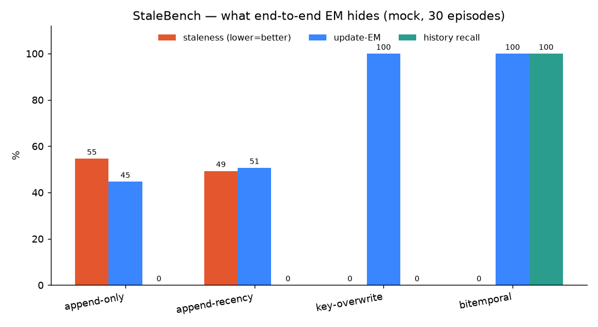
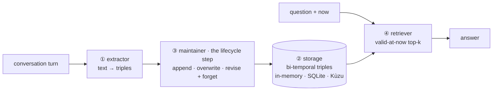
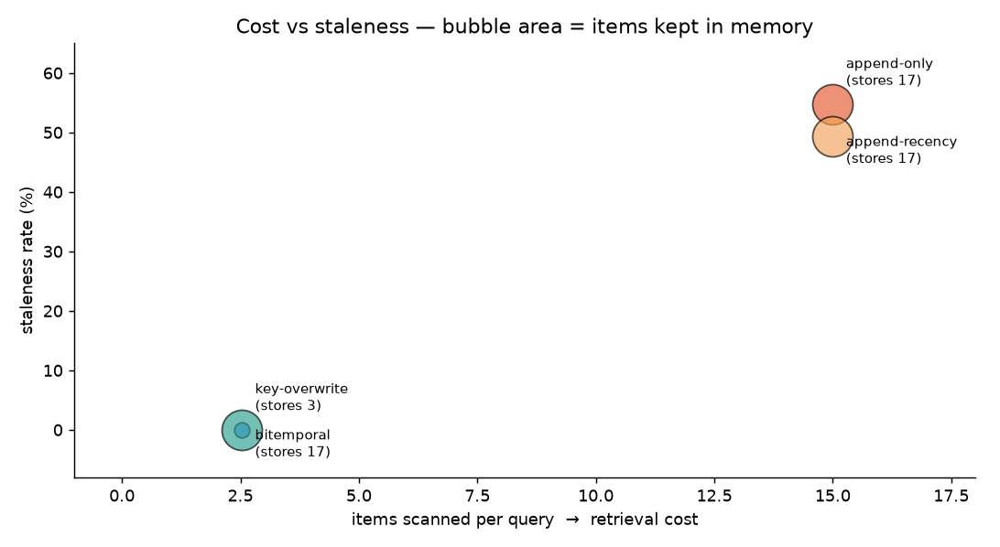

# Agent Memory Lab

[](https://github.com/loversky02/agent-memory-lab/actions/workflows/ci.yml)
&nbsp;
&nbsp;
&nbsp;

A small, **runnable** lab built from the paper
[*Are We Ready For An Agent-Native Memory System?*](https://arxiv.org/abs/2606.24775)
(Zhou et al., arXiv:2606.24775). The paper reframes agent memory as a **data
system** with four modules and argues that end-to-end scores (F1/EM) hide the
real failure mode: **invalidation** — agents store happily but can't retract a
fact that was true last week, so stale memory quietly corrupts the next answer.

This repo makes that measurable. It treats memory as four swappable modules,
ships several real backends across three storage engines (+ ablations), and
scores them on metrics that look *below* the final answer.

<p align="center">
  <br>
  <em>Same conversation, four memory designs. Update-EM looks comparable — staleness and history recall do not.</em>
</p>

The four modules, and where the lifecycle decision lives:



Runs **offline and deterministic** by default (`mock` provider, zero
dependencies). Flip to real models on Apple Silicon with the `mlx` provider.

## Four ideas, one repo

| Idea | Where it lives |
|---|---|
| **Ablation playground** — compose 4 modules, toggle one | [`backends.py`](agent_memory_lab/backends.py) |
| **MiniMemState** — GEM `revision`+`forgetting` on a bi-temporal graph | [`maintainers.py`](agent_memory_lab/modules/maintainers.py) |
| **StaleBench** — temporal-fact generator + invalidation metrics | [`stalebench/`](agent_memory_lab/stalebench) |
| **Cost-vs-Correctness** — per-op profiler + dashboard | [`profiler.py`](agent_memory_lab/core/profiler.py), [`dashboard/`](dashboard) |

## Quickstart

```bash
pip install -e ".[dev]"     # or: make install
make test                   # 28 tests, ~0.2s, all offline
python examples/quickstart.py
aml demo                    # one conversation, four backends, side by side
aml bench --backends all --episodes 30
aml gen --seed 7            # inspect a generated temporal-fact episode
```

## What you see

`aml demo` runs one conversation where the user keeps changing their mind
(Vim→VS Code; Python→Rust→*retracted*) and asks each backend the same questions:

```
=== append-only ===
  editor    current -> Vim       (gold VS Code)  [STALE]   # returns last week's fact
  editor    history -> None      (gold Vim)      [miss]    # no temporal trail
  language  current -> Rust      (gold None)     [STALE]   # ignores the retraction
=== bitemporal ===
  editor    current -> VS Code   (gold VS Code)  [ok]
  editor    history -> Vim       (gold Vim)      [ok]      # still queryable
  language  current -> None      (gold None)     [ok]      # retraction honored
```

`aml bench` aggregates over many seeded episodes (mock provider, 30 episodes):

```
backend             staleness  update-EM  history  invalidation-latency  store-size  avg-scanned
append-only             54.7%      44.7%     0.0%                 never       17.47         15.0
append-recency          49.3%      50.7%     0.0%                     0       17.47         15.0
key-overwrite            0.0%     100.0%     0.0%                     0        2.53         2.53
bitemporal               0.0%     100.0%   100.0%                     0       17.47         2.53
bitemporal-bounded       0.0%     100.0%    18.4%                     0        6.00         2.53
bitemporal-nomaint      54.7%      44.7%     0.0%                 never       17.47         15.0
```

Read it like the paper:

- **append-only** posts a respectable update-EM (44.7%) while being **stale 54.7%**
  of the time — exactly the "F1 looks fine, memory is rotting" trap.
- **append-recency** (keep newest per attribute) fixes simple *overwrites* but
  still can't handle a *retraction* — recency heuristics aren't invalidation.
- **key-overwrite** (Mem0-style) is current and tiny, but **amnesiac**: history
  recall 0%. Cheap, lossy.
- **bitemporal** (MiniMemState) is current **and** keeps an auditable trail
  (history 100%) — and because the time-aware reader only scans *valid* edges,
  it scans 2.5 items despite storing 17.5. *Localized maintenance beats global
  reorganization*, as the paper says.
- **bitemporal-nomaint** is the control: same time-aware reader, **maintenance
  off** → staleness snaps back to 54.7%. Maintenance is the cause, not storage.
- **bitemporal-bounded** turns on `forgetting` (bounded audit trail): correctness
  holds, history recall drops — the cost of forgetting, made explicit.

<p align="center">
  <br>
  <em>Ideal corner is bottom-left. Bitemporal lands there <strong>and</strong> keeps the most in memory — cheap reads, full history. Regenerate with <code>make figures</code>.</em>
</p>

## Storage engines — same semantics, real databases

The bi-temporal contract is storage-agnostic. `bitemporal` (in-memory),
`bitemporal-sqlite` (stdlib, file-persistable) and `bitemporal-kuzu` (embedded
property-graph engine) post **identical** staleness/EM/history — "memory is a
data system" taken literally:

```bash
aml bench --backends bitemporal,bitemporal-sqlite,bitemporal-kuzu
pip install -e ".[kuzu]"     # the Kùzu graph backend is an optional extra
```

## Real benchmarks — LoCoMo / LongMemEval

Adapters map the paper's actual workloads into the same pipeline (LongMemEval's
`knowledge-update` type is the dynamic-update setting StaleBench targets). They
are natural language, so they need a real LLM (`--provider mlx`); a tiny sample
fixture ships so the adapter itself runs offline.

```bash
aml dataset --name longmemeval --provider mlx
aml dataset --name locomo --path /path/to/locomo.json --provider mlx
```

## Metrics (in [`stalebench/metrics.py`](agent_memory_lab/stalebench/metrics.py))

- **staleness_rate** — % of answers that return a superseded/retracted value
  ("hallucination of the past"). The primitive the paper says EM never catches.
- **update_em** — substring-exact-match of the current answer vs gold.
- **history_recall** — can it still answer "what did I use *before*?" (needs a
  temporal trail).
- **invalidation_latency** — turns after an overwrite until the old value clears
  (`0` immediate, `never` if it never does).
- plus per-op cost from the profiler: `closes` (edge revisions), `forgets`,
  `avg_scanned`, store size.

## Real models on Apple Silicon (MLX / Metal)

```bash
pip install -e ".[mlx]"
aml bench --provider mlx           # real LLM + real embeddings
aml bench --provider mlx-hash      # real LLM + hash embeddings (no embed-model download)
# override models: AML_MLX_LLM / AML_MLX_EMBED env vars
```

The provider only changes embedding/extraction *quality* — memory semantics
(and therefore the staleness story) are provider-independent. `mock` exists so
tests and CI stay deterministic and offline.

**[RESULTS.md](RESULTS.md)** has an actual local-model run (Qwen2.5-0.5B on MLX):
the append-only-vs-bitemporal ordering and the scan-cost gap both survive a real
model — and the noisier numbers show extraction quality bounding everything.

## Dashboard

```bash
pip install -e ".[dashboard]"
streamlit run dashboard/app.py    # or: make dash
```

## Layout

```
agent_memory_lab/
  core/         MemoryItem (bi-temporal triple), MemorySystem, Profiler, similarity
  providers/    mock (offline, deterministic) | mlx (real, Apple Silicon)
  modules/      extractors · storage: in-memory / sqlite / kuzu · retrievers · maintainers
  datasets/     LoCoMo + LongMemEval adapters, NL runner, sample fixtures
  backends.py   the 4-module compositions (= the ablation playground)
  stalebench/   generator · metrics · runner
  cli.py        aml bench | demo | gen | dataset
dashboard/      streamlit cost-vs-correctness view
examples/       quickstart.py
assets/         make_figures.py + the generated README charts
tests/          28 behavioral + unit tests (kuzu tests auto-skip if absent)
.github/        CI — pytest on Python 3.11–3.13
```

## Honesty notes

- The workload is **synthetic and templated** so it's deterministic; it isolates
  the *lifecycle* failure, it is not a natural-language extraction benchmark. The
  `mlx` provider swaps in a real LLM extractor for open text.
- Maintenance here is **synchronous** (at ingest), so invalidation latency is
  0 or never. An async/batched maintainer would surface latencies in between —
  the metric is wired for that.
- Backend names map to the paper's families (append-only stores, fact-overwrite
  plugins, bi-temporal multi-versioning à la Zep/Graphiti), not to specific
  vendor implementations.

## References

- *Are We Ready For An Agent-Native Memory System?* — https://arxiv.org/abs/2606.24775
- *Is Agent Memory a Database?* (GEM: ingestion/revision/forgetting/retrieval) — https://arxiv.org/abs/2605.26252
- Reference code from the paper — https://github.com/OpenDataBox/MemoryData
